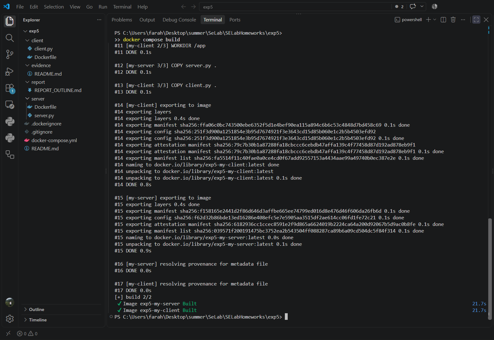
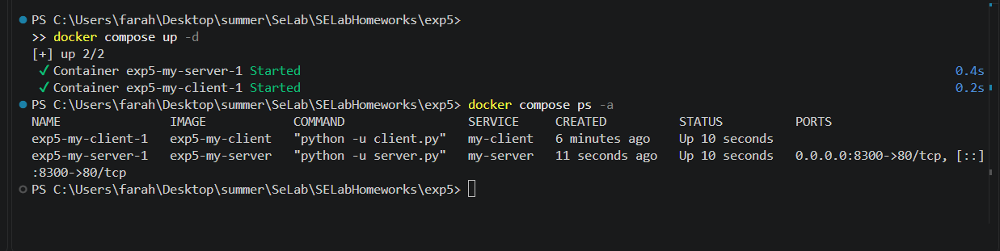
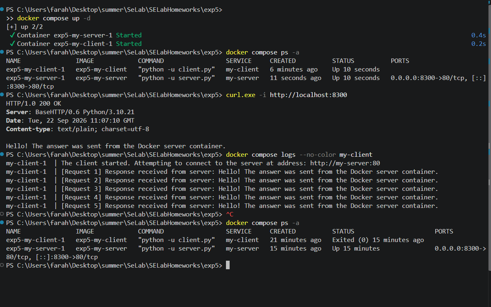
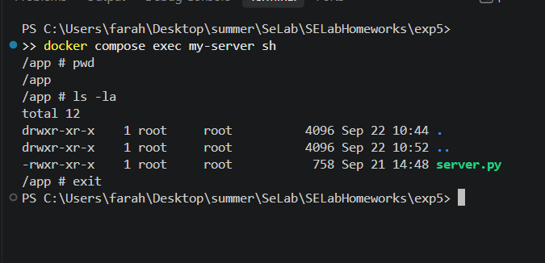

# Software Engineering Lab - Experiment 5: Docker Fundamentals

**Student:** Danial Farahani
**Student number:** 97105725

## 1. Objective

Deploy the handout's Python HTTP server and client as separate Docker containers; demonstrate Dockerfiles, Docker Compose, service networking, and host-to-container port forwarding (handout, pp. 1-4).

## 2. Environment

| Item | Observed configuration |
|---|---|
| Host | Windows, Docker Desktop with Linux containers / WSL 2 |
| Docker | 29.6.1 |
| Compose | 5.3.0 |
| Base image | `python:3.10-alpine` for each service |
| Server | HTTP on container port 80 |
| Client | `SERVER_HOST=my-server`; five GET requests, three seconds apart |
| Host mapping | `8300:80` |

The handout's displayed Python code is clipped on the right. The starter files reconstruct incomplete lines while preserving the specified behavior; results below are from the student's actual local execution.

## 3. Implementation

The server Dockerfile uses `FROM python:3.10-alpine`, `WORKDIR /app`, `COPY server.py .`, `EXPOSE 80`, and `CMD ["python", "-u", "server.py"]`. The client Dockerfile uses the same base and workdir, copies `client.py`, and starts it with `CMD ["python", "-u", "client.py"]`. `EXPOSE` documents the server port; `ports` in Compose makes the port reachable from the host.

The final local Compose configuration is:

```yaml
services:
  my-server:
    build:
      context: ./server
    ports:
      - "8300:80"
  my-client:
    build:
      context: ./client
    environment:
      SERVER_HOST: my-server
    depends_on:
      - my-server
```

Compose resolves `my-server` on its internal network. The client connects to `http://my-server:80`; the host uses `http://localhost:8300`. `depends_on` orders startup but does not guarantee application readiness.

**Port deviation:** The handout requests `8000:80`. Windows reserved TCP ports `7967-8066`, so binding 8000 failed. Changing only the host port to 8300 allowed deployment without changing the Python scripts or the container's port 80.

## 4. Execution and observed results

The following commands were used from the `exp5` directory:

```powershell
docker compose config --quiet
docker compose build
docker compose up -d
docker compose ps -a
curl.exe -i http://localhost:8300
docker compose logs --no-color my-client
docker compose exec my-server sh
```

Inside the server shell: `pwd`, `ls -la`, then `exit`.

### 4.1 Images and startup

Both `exp5-my-server` and `exp5-my-client` images built successfully. Compose started both services, publishing host port 8300 to port 80 in the server container.





### 4.2 HTTP and inter-container communication

`curl.exe -i http://localhost:8300` returned `HTTP/1.0 200 OK` and `Hello! The answer was sent from the Docker server container.` The client logs show five successful responses from `http://my-server:80`. The client later exited with code 0; the server remained running.



### 4.3 Server filesystem

`docker compose exec my-server sh` opened a shell; `pwd` returned `/app` and `ls -la` listed `server.py`. `exit` returned to PowerShell.



## 5. Handout questions

**1. What does `docker-compose.yml` do, and when should it be used instead of `docker run`?**
It declares multiple services and their image builds, settings, networking, environment variables, ports, and dependencies. `docker compose up` manages the defined application together; `docker run` is sufficient for running a single container individually.

**2. What is Kubernetes used for, and how does it relate to Docker? (Approximately two lines.)**
Kubernetes orchestrates containerized applications across machines, handling deployment, scaling, networking, and recovery. Docker can build compatible container images, but Kubernetes does not require Docker Engine as its runtime.

**3. Explain Docker Image, Container, and Volume.**
- **Image:** Reusable, read-only template packaging an application and dependencies; the Dockerfiles build two images.
- **Container:** A running instance of an image with isolated processes and a filesystem view; the server and client run in different containers.
- **Volume:** Docker-managed persistent storage that can be mounted into containers and survive container removal. No volume is required for this stateless exercise.

## 6. AI assistance disclosure

**Tool/model:** OpenAI ChatGPT assisted with planning, scaffolding, troubleshooting, evidence organization, and report drafting. The report was prepared with GPT-5.6 Sol; exact configurations used in all earlier chat steps were not independently recorded.

**Representative requests:** "read and construct our roadmap for doing it"; "give me a zip file containing initial stage of exp5"; "what is this error"; "give these screen shots you told me in a zip."

**Results and limitations:** AI prepared the initial file structure and source reconstruction, suggested Docker/Compose configuration, explained the Windows port reservation, and organized documentation. Clipped source lines required reconstruction. AI suggestions were not a substitute for testing: the student ran Docker locally and supplied genuine screenshots; the AI did not independently execute the student's Docker environment.

## 7. Conclusion

Both images were built, services were deployed, the host received HTTP 200, five client requests succeeded, and the server container's `/app` directory was inspected. Windows' reserved port 8000 was replaced with host port 8300 while keeping internal port 80. The TA waived the video requirement; the report and public GitHub repository link are the revised submission materials.

**Source:** Experiment 5 handout, pp. 1-4; actual local execution screenshots under `../evidence/`.
